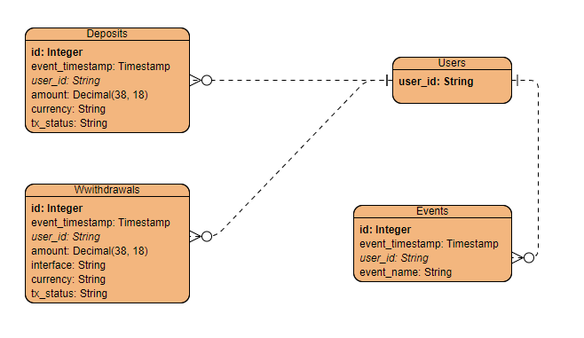

# Table of contents

- [Table of contents](#table-of-contents)
- [The solution](#the-solution)
  - [ETL Jobs](#etl-jobs)
  - [Modeling and Representing monetary values in code](#modeling-and-representing-monetary-values-in-code)
  - [Quering](#quering)

# The solution

## ETL Jobs

Providing data for querying is a task that demands collecting data from sources, moving data to the datalake storage, (when possible) enforcing a schema, and publishing the dataset for usage. Usually, the final dataset is published using parquet format, allowing incremental writing and good query performance on several query engines (AWS Athena, SparkSQL, stand-alone Presto, or Apache Drill instances).

For each CSV, we have one script that applies these steps:
- read from the origin
- apply a schema
- write into parquet files

These scripts under the `etl` folder can receive the following parameters:

- `--input` Where to find the CSV files (default: ./input)
- `--output` Where to write the Parquet files (default: ./output)
- `--writingmode` Which writing mode to use(append/overwrite)? (default: overwrite)

The only dependencies are pyspark and pandas. To prepare your local env use:
```
$ pip install -r {ingest-files app folder}/requirements.txt
```

We are using Apache Spark to process the data. From the ingest-files folder, you need to submit the job using spark-submit:

```
$ spark-submit etl/deposits.py
$ spark-submit etl/withdrawals.py
$ spark-submit etl/events.py
$ spark-submit etl/users.py
```

To process daily incremental batches, you submit the jobs passing the `--writingmode` parameter and change the `--input` to the cumulative data folder, if needed.

```
$ spark-submit etl/deposits.py --writingmode append
$ spark-submit etl/withdrawals.py --writingmode append
$ spark-submit etl/events.py --writingmode append
$ spark-submit etl/users.py --writingmode append
```

In a production scenario, the output dir will be a S3 location, but we are using local files for this exercise.

After running the ETL scripts, we can move to querying.

## Modeling and Representing monetary values in code

Given the queries and sample data, there is no unusual modeling, each entity maps to one file, and the keys and relationships are presented here:



There is an attention point for `amount` fields. Finance is very sensitive to decimal places, and rounding can cause issues when computing balances, fees, and spreads.
Using a datatype that enforces the decimal places is mandatory, which is why Double/Float data types are unsuited for finance.
Luckily, Spark has the Decimal datatype, where you can specify precision and scale. As long as I can remember, 18 decimal places are necessary to store the smallest unity in Etherium (a wei), and I can't remember any crypto with more than that.

Given that 38 is the maximum precision, we can store 10^18 decimal places and 10^20 numbers at the integer part of the number. We can safely achieve the necessary safety with the `Decimal(38, 18)` datatype setting.

## Quering

In a datalake environment, we might have a SQL engine to use (AWS Athena, SparkSQL, stand-alone Presto, or Apache Drill instances), and then we can create external tables to read from the parquet files from S3 buckets.

As we are in a local environment, we can query the parquet using SparSQL. There is a Spark job under the `query` folder that executes the SQL against the parquet files and writes the output to CSV using pandas (using Spark for this will generate partitioned CSV files that are not so good for humans to read).

The script can receive the following parameters:

- `--deposits` : Deposits dataset parquet files location (default: ./output/).
- `--withdrawals` : Withdrawals dataset parquet files location (default: ./output/).
- `--events` : Events dataset parquet files location (default: ./output/).
- `--users` : Users dataset parquet files location (default: ./output/).
- `--output` : Output folger for CSVs (default: ./output/csv/)

Submit the query job with:

```
$ spark-submit query/query.py
```

And check the results at the `./output/csv/` folder.